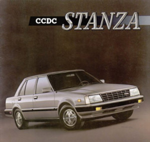
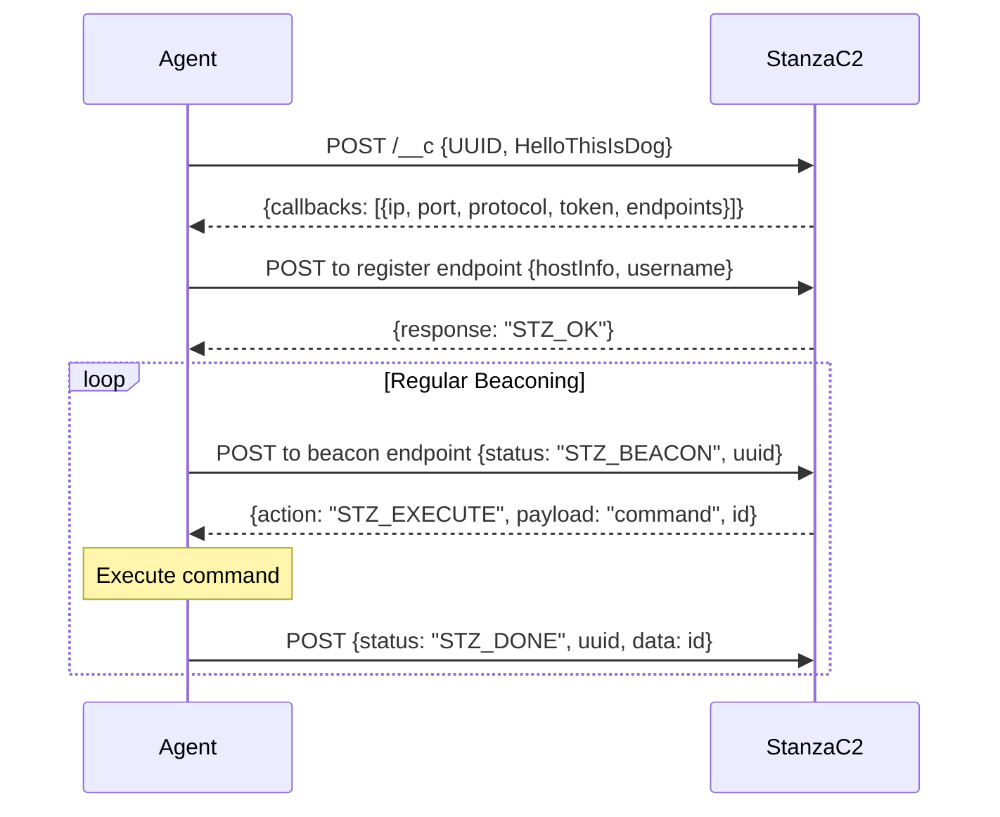
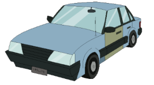

<div align="center"></div>



## Building

This project builds binaries for OSX, Linux, Windows and FreeBSD. Just use the appropiate ``make`` command and you are good to go!

Just run ``make`` and both agent and server will be built from source. By default it will be built for the architecture that issues the build command but you can also build different targets.
These are all the agent targets you can build:

* ``make agent_linux32``
* ``make agent_linux64``
* ``make agent_windows32``
* ``make agent_windows64``
* ``make agent_osx``
* ``make agent_freebsd32``
* ``make agent_freebsd64``

And all the servers, they will build only for the current architecture:

* ``make admin``
* ``make http``
* ``make tcp``
* ``make udp``

## HTTP(S) Server

The HTTP server is the web interface for the Stanza C2 server. It allows you to register agents, execute commands, and and manage their settings. The server can be deployed using `http` or `https` protocols.

## Admin Server

The admin server is a web interface that allows you to manage the Stanza C2 server and its agents. It provides a user-friendly interface to view and control agents, execute commands, and manage files.

## Agent

The agent can be used with just ``./stzagent`` inside of the vagrant machine (or in the system you are using as server), and it will connect to ``localhost`` using HTTPS. If you want to change the default values see the following examples as reference. Using environment variables:

```shell
STZ_CALLBACKS=https://1.2.3.4/callbacks STZ_MIN=10 STZ_MAX=20 ./stzagent
```

## Development

Just clone the repository and using docker you can have a full development environment ready to go. The Dockerfile will build the agent and the servers, use the following command to build the image:

```shell
make docker_dev_build
```

Once the images are built, you can run the development environment with:

```shell
make docker_dev_run
```

If you want to develop locally and compile things by hand, you can use the ``Makefile`` for that purpose. See the *Building* section.

## WIP - TBD - Eventually it will get done

### TCP Server

The TCP server is a simple server that listens for incoming connections and handles them. It is designed to be used with the Stanza C2 agent, allowing it to communicate with the server over TCP.

### UDP Server

The UDP server is a simple server that listens for incoming packets and handles them. It is designed to be used with the Stanza C2 agent, allowing it to communicate with the server over UDP.


<div align="center"></div>
